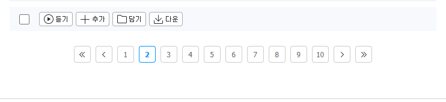
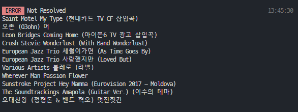

### To Spotify

- 스포티파이로 플레이리스트나 좋아요한 아티스트, 앨범, 트랙 목록을 옮길 수 있습니다
- 현재 지니만 지원

<br/>


## 설치

### Windows

<p align="center">

</p>
                                                                                                                            
**Powershell** 을 **Windows** 검색창에 치고 우클릭해서 **관리자의 권한으로 실행**
아래 **커맨드**들을 복붙 엔터

- **node, npm 설치**
```bash
iwr -useb get.scoop.sh | iex
scoop install nodejs
```

- **to-sptify 설치**
```bash
npm i -g to-spotify
g2s --help
```
### Other OSs
node, npm [설치](https://nodejs.org/ko/download/)하고 위 **커맨드**를 실행

<br/>

# 사용법

### 1. 지니 아이디 보기

지니뮤직에 들어가서 플레이리스트에 나의 좋아요를 누릅니다
리스트에서 2번째 페이지나 다른 페이지를 클릭합니다

<p align="center">

</p>

<p align="center">

</p>

여기 url 에 bgsq=뭐라뭐라 부분을 기억합니다

### 2. Spotify에 인증할 토큰 발급

- [여기](https://developer.spotify.com/console/get-search-item/)
에서 아래 사진같이 받을 수 있습니다

<p align="center">

</p>
<p align="center">

</p>

- 토큰이 아주 기니까 일부만 복사하지 않도록 조심


<br/>

## 플레이리스트 옮기기

플레이리스트 genie 페이지에 들어가서 플레이리스트를 공개 url의 mxnm을 기억합니다
- 공개된 플레이리스트가 아니라면 수정하기 눌러서 공개된 플레이리스트로 수정

<p align="center">

</p>


```bash
g2s playlist --bgsq blablanumber --mxnm blabla --stoken blablatoolong...
```

한글이 포함되어 있는 곡들은 잘 안찾아지는 경향이 있어서 이전 실패 곡들이 리스트들이 곡들이 아래처럼 커맨드창에 뜰텐데
해당 곡들은 직접 넣어야 합니다 ㅠㅠ

<br/>

## 좋아요 리스트 옮기기
bssq와 stoken을 넣어주면 자동으로 좋아요 리스트들을 이전합니다

```bash
g2s liked albums --bgsq blablanumber --stoken blablatoolong...
g2s liked tracks --bgsq blablanumber --stoken blablatoolong...
g2s liked artists --bgsq blablanumber --stoken blablatoolong...
```

<p align="center">

</p>

마찬가지로 안옮겨진 친구들은 손으로 옮겨줘야!


# 기능
- Migrate Liked Music List
- Migrate Liked Album List
- Migrate Liked Artist List
- Playlist Migration

# Soon
- Melon Support


# Develop

### Local install
```bash
git clone https://github.com/seonglae/to-spotify
npm i -g pnpm
pnpm i
npm uninstall -g to-spotify
pnpm cli
g2s
```
