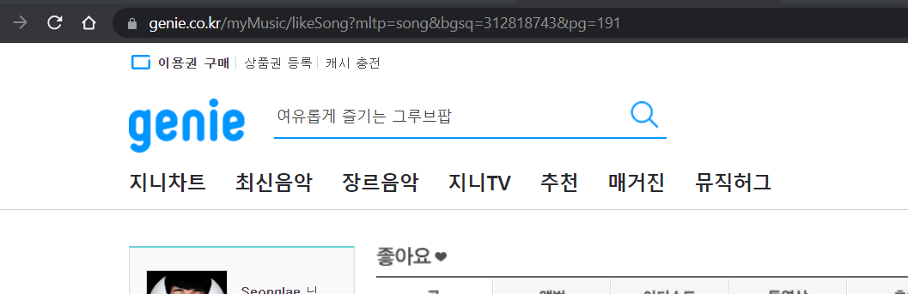
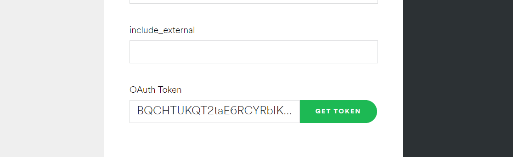
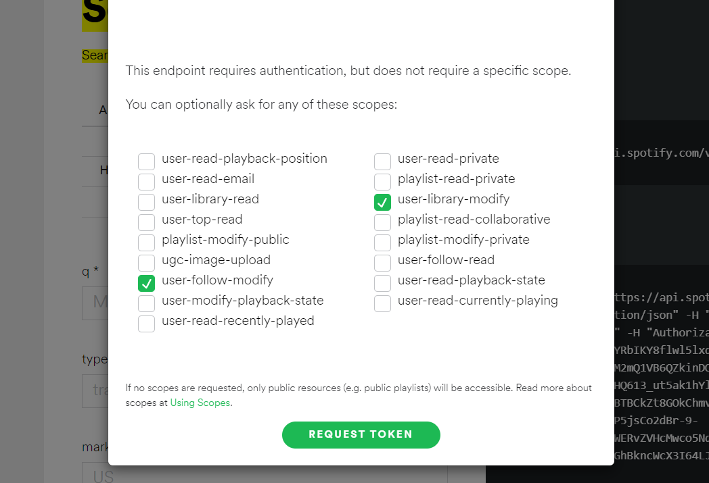

# Genie To Spotify

### Spotify Migration Tool from Genie

<br/>

# Feature
- Migrate Liked Music List
- Migrate Liked Album List
- Migrate Liked Artist List
# Todo
- Playlist Migration


# Install
```
git clone https://github.com/seonglae/genie-to-spotify
npm i -g pnpm
pnpm i
pnpm install
g2s
```


# Usage
- You need bgsq of yout genie id (your id must be public)
- You nee spotify token from [here](https://developer.spotify.com/console/put-following/?type=&ids=)

### GID is bgsq in url


### Spotify token get method




```bash
g2s like album --gid=blablanumber --stoken=blablatoolong...
g2s like track --gid=blablanumber --stoken=blablatoolong...
g2s like artist --gid=blablanumber --stoken=blablatoolong...
```

There will be show unresolved list
That should be migrated manually


If you want to migrate playlist, check [here](https://www.clien.net/service/board/lecture/15959548)